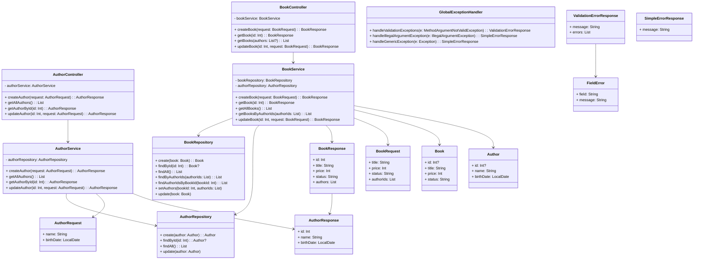

```mermaid
%% NOTE: PrivateメソッドやConfigクラスはclassDiagramに含めません
classDiagram
    %% === Controller ===
    class BookController {
        - bookService: BookService
        + createBook(request: BookRequest): BookResponse
        + getBook(id: Int): BookResponse
        + getBooks(authors: List<Int>?): List<BookResponse>
        + updateBook(id: Int, request: BookRequest): BookResponse
    }

    class AuthorController {
        - authorService: AuthorService
        + createAuthor(request: AuthorRequest): AuthorResponse
        + getAllAuthors(): List<AuthorResponse>
        + getAuthorById(id: Int): AuthorResponse
        + updateAuthor(id: Int, request: AuthorRequest): AuthorResponse
    }

    class GlobalExceptionHandler {
        + handleValidationExceptions(e: MethodArgumentNotValidException): ValidationErrorResponse
        + handleIllegalArgumentException(e: IllegalArgumentException): SimpleErrorResponse
        + handleGenericException(e: Exception): SimpleErrorResponse
    }

    %% === Service ===
    class BookService {
        - bookRepository: BookRepository
        - authorRepository: AuthorRepository
        + createBook(request: BookRequest): BookResponse
        + getBook(id: Int): BookResponse
        + getAllBooks(): List<BookResponse>
        + getBooksByAuthorIds(authorIds: List<Int>): List<BookResponse>
        + updateBook(id: Int, request: BookRequest): BookResponse
    }

    class AuthorService {
        - authorRepository: AuthorRepository
        + createAuthor(request: AuthorRequest): AuthorResponse
        + getAllAuthors(): List<AuthorResponse>
        + getAuthorById(id: Int): AuthorResponse
        + updateAuthor(id: Int, request: AuthorRequest): AuthorResponse
    }

    %% === Repository ===
    class BookRepository {
        + create(book: Book): Book
        + findById(id: Int): Book?
        + findAll(): List<Book>
        + findByAuthorIds(authorIds: List<Int>): List<Book>
        + findAuthorIdsByBookId(bookId: Int): List<Int>
        + setAuthors(bookId: Int, authorIds: List<Int>)
        + update(book: Book)
    }

    class AuthorRepository {
        + create(author: Author): Author
        + findById(id: Int): Author?
        + findAll(): List<Author>
        + update(author: Author)
    }

    %% === DTO ===
    class BookRequest {
        + title: String
        + price: Int
        + status: String
        + authorIds: List<Int>
    }

    class BookResponse {
        + id: Int
        + title: String
        + price: Int
        + status: String
        + authors: List<AuthorResponse>
    }

    class AuthorRequest {
        + name: String
        + birthDate: LocalDate
    }

    class AuthorResponse {
        + id: Int
        + name: String
        + birthDate: LocalDate
    }

    %% === Model ===
    class Book {
        + id: Int?
        + title: String
        + price: Int
        + status: String
    }

    class Author {
        + id: Int?
        + name: String
        + birthDate: LocalDate
    }

    %% === Global Error DTOs ===
    class ValidationErrorResponse {
        + message: String
        + errors: List<FieldError>
    }

    class FieldError {
        + field: String
        + message: String
    }

    class SimpleErrorResponse {
        + message: String
    }

    %% === Relationships ===
    BookController --> BookService
    AuthorController --> AuthorService

    BookService --> BookRepository
    BookService --> AuthorRepository
    BookService --> BookResponse
    BookService --> BookRequest
    BookService --> Book
    BookService --> Author

    AuthorService --> AuthorRepository
    AuthorService --> AuthorRequest
    AuthorService --> AuthorResponse

    BookResponse --> AuthorResponse
    ValidationErrorResponse --> FieldError
```
