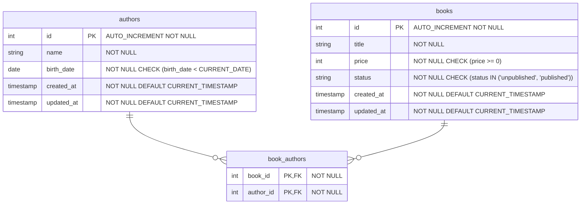

```mermaid
erDiagram
    authors {
        int id PK "AUTO_INCREMENT NOT NULL"
        string name "NOT NULL"
        date birth_date "NOT NULL CHECK (birth_date < CURRENT_DATE)"
        timestamp created_at "NOT NULL DEFAULT CURRENT_TIMESTAMP"
        timestamp updated_at "NOT NULL DEFAULT CURRENT_TIMESTAMP"
    }
    books {
        int id PK "AUTO_INCREMENT NOT NULL"
        string title "NOT NULL"
        int price "NOT NULL CHECK (price >= 0)"
        string status "NOT NULL CHECK (status IN ('unpublished', 'published'))"
        timestamp created_at "NOT NULL DEFAULT CURRENT_TIMESTAMP"
        timestamp updated_at "NOT NULL DEFAULT CURRENT_TIMESTAMP"
    }
    book_authors {
        int book_id PK, FK "NOT NULL"
        int author_id PK, FK "NOT NULL"
    }

    authors ||--o{ book_authors : ""
    books ||--o{ book_authors : ""
```
